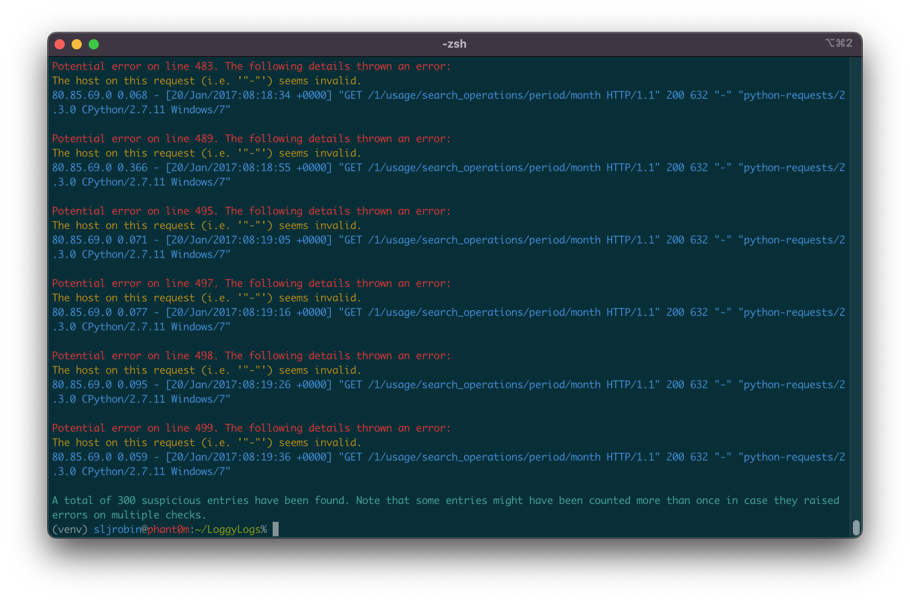
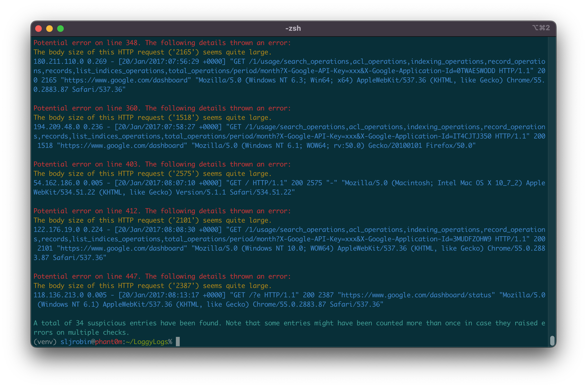
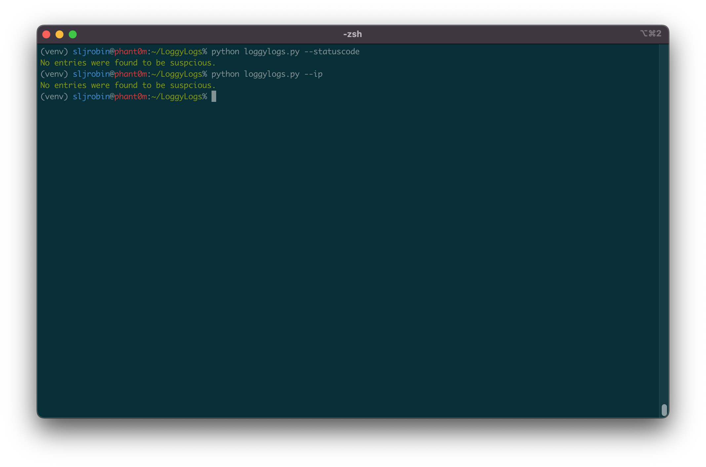

> :warning: **This project is no longer actively maintained**: feel free to [contact me](https://sljrobin.org) if you need more information.

<p align="center"></p>

**LoggyLogs** is a *parser for log servers*. Its goal is to **help detecting vulnerabilities** in HTTP requests. It supports [**NGINX**](https://www.nginx.com/) and **[Apache](https://httpd.apache.org/) logs**. This tool was created during a professional engagement, and was shared for **educational purposes only**.



<p align="center">🔍</p>

For each HTTP request, **LoggyLogs** is capable of detecting:

* If the [host](https://developer.mozilla.org/en-US/docs/Web/HTTP/Headers/Host) is valid
* If the [IP address](https://en.wikipedia.org/wiki/IP_address) is valid
* If the [HTTP status](https://en.wikipedia.org/wiki/List_of_HTTP_status_codes) code is valid
* If [HTTPS](https://en.wikipedia.org/wiki/HTTPS) is properly enforced, to ensure the traffic is encrypted
* If the [user agent](https://en.wikipedia.org/wiki/User_agent) is a recognized web browser
* If endpoints are actually related to the API, to detect potential [brute-force attacks](https://en.wikipedia.org/wiki/Brute-force_attack)
* If the body size is not too big, as those could lead to [denial-of-service (DoS) attacks](https://en.wikipedia.org/wiki/Denial-of-service_attack)
* If non-secure HTTP methods are used (i.e. `TRACE` or `DEBUG`), as those could lead to several [information disclosures](https://portswigger.net/kb/issues/00500a00_http-trace-method-is-enabled)

**Note**: All the tests mentioned above can be run at once!

<p align="center">🔍</p>

* [**Getting started**](#getting-started): This section provides everything that is required to install LoggyLogs.
* [**Usage**](#usage): This section shows how to configure LoggyLogs to have the best outputs possible. It includes:
    1. [First run](#first-run): How to run LoggyLogs for the first time
    2. [Tweak parameters](#tweak-the-parameters): How to modify several values in the source code
* [**Examples**](#examples): A few examples of outputs are shown in this section.
* [**Going further**](#going-further): LoggyLogs has been designed as an open source project since day 1. This section includes:
    1. [Code documentation](#code-documentation): To clarify the tool's internals, and explaining how to generate the source code documentation
    2. [Improvements](#improvements): Additional features that could be implemented to make LoggyLogs even more efficient
* [**License**](#license): The license of the project.

<p align="center">🔍</p>

## Getting started
* Clone this repository: `git clone https://github.com/sljrobin/LoggyLogs`
* Go to the LoggyLogs directory: `cd LoggyLogs/`
* Create and activate a [Python virtual environment](https://docs.python.org/3/library/venv.html):
    * `python3 -m venv venv`
    * `source ./venv/bin/activate`
* Install the requirements with [pip3](https://pypi.org/project/pip/): `pip install -r requirements.txt`

## Usage
### First run
* Ensure first the Python virtual environment is enabled by running `source ./venv/bin/activate`
* Run [LoggyLogs](https://github.com/sljrobin/LoggyLogs) for the first time: `python loggylogs.py --help`

```
% python loggylogs.py --help
usage: loggylogs.py [-h] [--all] [--bodysize] [--host] [--ip] [--httpmethod] [--httpprotocol] [--statuscode] [--url] [--useragent]

optional arguments:
  -h, --help      show this help message and exit
  --all           Perform all the available tests
  --bodysize      Check the body size is not too important
  --host          Check the host is valid
  --ip            Check the IP address is valid
  --httpmethod    Check which HTTP method is being used
  --httpprotocol  Check if HTTP connections (i.e. without encryption) are made to the server
  --statuscode    Check the HTTP status code
  --url           Check the URL is an endpoint available within the API documentation
  --useragent     Check the user agent is a recognized web browser
```

### Tweak the parameters
:warning: Before running LoggyLogs to analyze logs, several parameters need to be tweaked.

**Under the [`data/` directory](./data/):**

* Put the logs to analyze here:
    * A file example named [`samples.log`](./data/samples.log) is already present
    * Feel free to replace it
    * In case the analysis of several files is required, change the `LOGS_PATH` constant in [`loggylogs.py`](./loggylogs.py) (e.g. `LOGS_PATH = './data/new-samples.log'`)
* If need be, add more [user agents](https://en.wikipedia.org/wiki/User_agent):
    * The `user-agents.txt` file already contains an exhaustive list of [user agents](https://en.wikipedia.org/wiki/User_agent)
    * Other lists are available on the Internet, like [this one](https://developers.whatismybrowser.com/useragents/explore/)

**In the [`lib/scanner.py` file](./lib/scanner.py):**

* Depending on which endpoints are valid or not, modify the `self.__hosts` and `self.__urls` variables
* An example is shown below:

```py
self.__hosts = ['https://www.google.com/', 'https://status.google.com/']
self.__urls = ['/1/indexing', '/1/infrastructure', '/1/inventory', '/1/latency', '/1/reachability', '/1/status']
```

* In addition, it might be useful to modify the `self.__limit_body_size` variable to inform LoggyLogs when raising an alert when an HTTP request is considered too large
* The default size has been set to 1,500 bytes, as shown below:

```py
self.__limit_body_size = 1500
```

🎉 **Everything is now ready!**

## Examples
Once LoggyLogs is set, it can parse HTTP requests, and eventually detect suspicious activities. To run it, use the following command:

```
python loggylogs.py --<test>
```

An example of output with the `--bodysize` test:

```
python loggylogs.py --bodysize
```



An example of output with the `--host` test:

```
python loggylogs.py --host
```


An example of output with the `--statuscode` and `--ip` tests:

```
python loggylogs.py --statuscode
python loggylogs.py --ip
```



## Going further
As a project never ends, the following might help the most curious.

### Code documentation
* The source code of [LoggyLogs](https://github.com/sljrobin/LoggyLogs) has been thoroughly documented in order to help people adding new features or simply improving the code
* Because the code is commented, generating a documentation becomes easy
* Amongst [most popular solutions](https://wiki.python.org/moin/DocumentationTools), we recommend using [pydoc](https://docs.python.org/3/library/pydoc.html) for the documentation generation process.
* Examples:
    * Generate the documentation for the `Parser()` class: `python -m pydoc lib/parser.py`
    * Generate the documentation for the entire library: `python -m pydoc lib/*`
    * Follow this [tutorial](https://www.youtube.com/watch?v=URBSvqib0xw) for more information about [pydoc](https://docs.python.org/3/library/pydoc.html)
* Snippet of the documentation for the `lib/scanner.py` class:

```nohighlight
NAME
    scanner

CLASSES
    builtins.object
        Scanner

    class Scanner(builtins.object)
     |  Scanner(display)
     |
     |  Methods defined here:
     |
     |  __init__(self, display)
     |      Initialize the Scanner object.
     |
     |      :param Display display: a Display object from the internal library.
     |
     |  check_all(self)
     |      Perform all the checks previously described.
     |
     |  check_body_size(self)
     |      Check the size (in bytes) of the HTTP request. Large requests might be used during denial of service (DoS)
     |      attacks to exhaust the server. If the request appears too large, display an error.
     |
     |  check_host(self)
     |      Check the host used to perform the request is related to the API, following a whitelist approach. If not,
     |      display an error.
[...]
```

### Improvements
Improvements could be added to [LoggyLogs](https://github.com/sljrobin/LoggyLogs) to make it even more efficient. Several thoughts are shared below:

* For the IP address, a **DNS lookup** could be implemented. This, used in conjunction with a blacklist of domains, could be used to detect potential DoS or DDoS attacks
* **Groups of requests from the same IP address** could be made. From there, **inspection of the timestamps** between each log could be performed – note that a method to extract the date of each log entry has successfully been created. This could help in detecting potential DoS attacks
* For each URL, a **search for specific characters** could help detecting potential injection attacks. For instance, characters like `<`, `{`, `;`, or `'`, might be injected to test for cross-site scripting (XSS) attacks or SQL injections
* Still, with the URL, **lists of known endpoints** could be banned. For example, the lists of [DirBuster](https://www.kali.org/tools/dirbuster/) or other [web wordlists](https://blog.sec-it.fr/en/2021/03/02/web-wordlists/) could be used as blacklists of endpoints. On the server-side, it would be required to ensure all the proper checks have been implemented so that those resources cannot be accessed without proper authorization
* Instead of using a file, **regular expressions for user agents** could be added, just like [this one](https://jonlabelle.com/snippets/view/yaml/browser-user-agent-regular-expressions)
* **Optimization of the log analysis** could be made with specialized libraries. The [advertools library](https://advertools.readthedocs.io/) seems to be an interesting approach. Indeed, the logs are being compressed and the analysis appears to be much faster

## License
[LoggyLogs](https://github.com/sljrobin/LoggyLogs) is licensed under the MIT License ([Source](./LICENSE)).